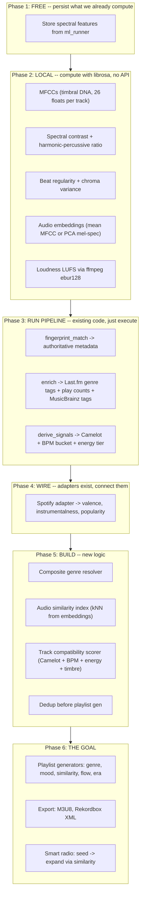

# MuseSleuth: Information Gaps for Playlist Generation

## Goal

Turn 31K un-listened tracks into intelligent playlists/streams that "just work" -- Pandora-level smarts, fully automated.

## Currently Running

- **ml_classify**: actively processing ~28K remaining tracks
- **integrity backfill**: running in parallel

---

## What Pandora Knows vs What We Have

Pandora's Music Genome Project uses ~450 hand-annotated attributes per song. We can't replicate musicologists, but we can get surprisingly close with automated analysis. Here's dimension by dimension:

### 1. Rhythm and Tempo

- BPM -- **HAVE** (dual-source cross-checked, aubio + librosa)
- BPM confidence -- **HAVE**
- Tempo category -- **HAVE** (slow/moderate/mid-tempo/upbeat/fast/very-fast)
- Time signature -- **MISSING** (3/4 vs 4/4 vs 6/8 matters for mixing; Spotify API has it, or can compute locally)
- Beat regularity -- **MISSING** (onset strength variance -- four-on-floor vs breakbeat vs freeform)
- Rhythmic complexity -- **MISSING** (syncopation level)
- Groove/swing -- **MISSING** (micro-timing deviation from the grid)

### 2. Harmony and Key

- Key + mode -- **HAVE** (chroma-based, librosa)
- Camelot notation -- **COMPUTED but not stored** (derive_signals hasn't run yet; 0 rows in playlist_signals)
- Harmonic complexity -- **MISSING** (chroma variance -- simple 2-chord loop vs jazz harmony)
- Chord progression type -- **MISSING** (would need a dedicated model)

### 3. Timbre and Texture -- "what it sounds like"

This is where Pandora shines and where we have the biggest gap -- and also the biggest quick win.

- Spectral centroid (brightness) -- **COMPUTED BUT THROWN AWAY** (in [ml_runner.py](src/musesleuth/ml_runner.py) `_analyze_spectral_features()`)
- Spectral bandwidth -- **COMPUTED BUT THROWN AWAY**
- Spectral rolloff -- **COMPUTED BUT THROWN AWAY**
- Spectral flatness (tonal vs noise) -- **COMPUTED BUT THROWN AWAY**
- Zero crossing rate -- **COMPUTED BUT THROWN AWAY**
- MFCCs (timbral DNA) -- **MISSING** (THE key feature for "sounds like" matching; 13-20 coefficients, trivial to add with librosa)
- Spectral contrast -- **MISSING** (texture richness across frequency bands)
- Harmonic-to-percussive ratio -- **MISSING** (is this track mostly beats or mostly melody? `librosa.effects.hpss`)
- Tonnetz -- **MISSING** (harmonic relationships / tonal centroid)

**The 5 spectral features being thrown away after computation is the single biggest quick win.** Zero additional processing, just store what `ml_runner.py` already calculates.

### 4. Energy and Dynamics

- Energy (RMS) -- **HAVE**
- Dynamic range -- **HAVE**
- Onset density -- **HAVE**
- Peak RMS -- **HAVE**
- Energy category -- **HAVE**
- Loudness (LUFS) -- **MISSING** (column exists in `technical_features.loudness_db`, never populated; can compute via ffmpeg `ebur128` filter)
- ReplayGain -- **MISSING** (column exists in `technical_features.replaygain`, never populated)

### 5. Mood and Emotion

- Mood tags -- **HAVE** (heuristic: BPM + energy + spectral thresholds)
- Danceability -- **HAVE** (heuristic)
- Acousticness -- **HAVE** (heuristic)
- **Valence (happiness/sadness)** -- **MISSING** -- this is arguably the single most important mood dimension Pandora uses. Spotify API has it, or we'd need a dedicated model.
- Arousal (calm vs intense) -- **MISSING** (can approximate from energy + onset density)
- Emotional arc -- **MISSING** (would need sectional analysis)

### 6. Vocals

- Vocal type (vocal/instrumental/spoken) -- **HAVE** (in `ml_features.vocal_type`)
- Vocal confidence -- **HAVE**
- Male/female/mixed -- **MISSING** (would need a classifier)
- Vocal prominence -- **MISSING** (can approximate via harmonic-percussive separation)

### 7. Genre and Style -- currently the weakest link

- Genre (EDM model) -- **HAVE but unreliable** (34% of tracks classified as "jazz" because the model only knows EDM subgenres)
- Genre tags (Last.fm) -- **MISSING** (`genres_tags` table is empty; enrich hasn't run)
- Genre tags (MusicBrainz) -- **MISSING** (same)
- Genre tags (Spotify) -- **MISSING** (adapter exists but not wired)
- **Composite/consensus genre** -- **MISSING** (need to combine all sources)

### 8. Popularity and Cultural Context

- Last.fm play/listener counts -- **MISSING** (`track_stats` has 5 rows; enrich hasn't run)
- Similar artists -- **MISSING** (`artist_stats` has 5 rows)
- Spotify popularity -- **MISSING** (adapter exists, not wired)
- Scene/movement association -- **MISSING** (would need curation)

### 9. Audio Similarity -- how "radio stations" actually work

- **Audio embeddings** -- **MISSING** -- this is the single most important feature for Pandora-style radio. Without it, you can only group by discrete labels. With it, you find tracks that *sound alike* regardless of genre labels.
- **Nearest-neighbor index** -- **MISSING** (pre-computed "top-N similar tracks" per track)
- Chromaprint fingerprint -- **HAVE** (identifies the recording, but not useful for similarity)

### 10. Structure (DJ-specific)

- Duration -- **HAVE**
- Song sections (intro/verse/chorus/drop/outro) -- **MISSING**
- Intro/outro duration -- **MISSING** (critical for DJ mixing)
- Drop timestamps -- **MISSING** (energy envelope peaks)
- Mix-in/mix-out points -- **MISSING**

---

## Summary Scorecard

```
Dimension              Status          Quick Fix?
---------------------------------------------------------
Rhythm/Tempo           70% covered     Add beat regularity (local)
Harmony/Key            60% covered     Run derive_signals + add chroma variance
Timbre/Texture         0% stored!      Persist existing spectral + add MFCCs
Energy/Dynamics        80% covered     Add LUFS (ffmpeg)
Mood/Emotion           40% covered     Need valence (Spotify or model)
Vocals                 50% covered     Good enough for V1
Genre                  BROKEN          Run enrich + build composite resolver
Popularity             0% covered      Run enrich + wire Spotify
Audio Similarity       0%              Add MFCCs + embeddings + index
Structure              10%             Not needed for V1 playlists
```

---

## The Path to "Sure Fire" Playlists




### What we can do RIGHT NOW (while ml_classify runs)

1. **Persist spectral features** -- trivial change to `ml_runner.py`, add 5 columns to `ml_features` or new table
2. **Add MFCC extraction** -- extend ml_classify or create a new lightweight stage
3. **Design audio embedding storage** -- how to store and index 26-dimensional vectors in SQLite
4. **Design playlist schema** -- `playlists` + `playlist_tracks` tables
5. **Wire Spotify adapter** into `enrich_runner.py` so it's ready when enrich runs

### What needs ml_classify to finish first

1. Run fingerprint_match, enrich, derive_signals
2. Build composite genre resolver (needs enrichment data)
3. Build audio similarity index (needs MFCCs from all tracks)
4. Build playlist generators

---

## What We Realistically Can't Get

- Pandora's 450 hand-annotated attributes (musicologists, not code)
- Vocal gender without a dedicated ML model
- Chord progressions without a dedicated ML model
- True emotional arc without sectional analysis

But with spectral features + MFCCs + enrichment + composite genre + audio embeddings, we'd have enough data to build playlists that rival Pandora's auto-generated stations for a personal collection. The key insight is that **similarity-based recommendations (from audio embeddings) are more powerful than rule-based ones (from genre labels)** -- and that's entirely computable locally.