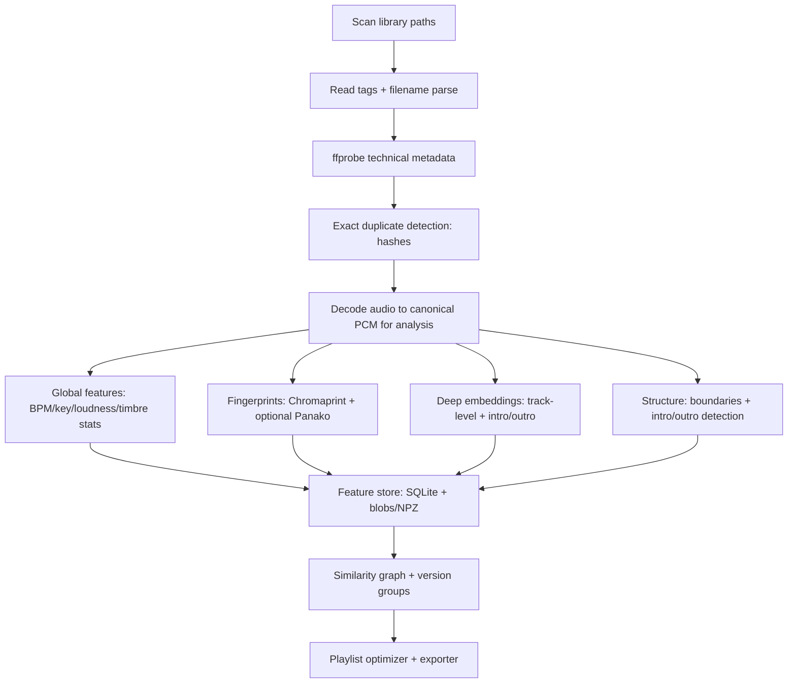
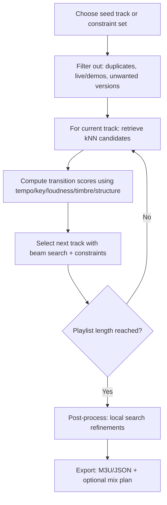

# Blind Static Analysis for DJ-Style Playlist Generation in Large Local Music Libraries

## Executive summary

Building “pleasing” playlists from thousands of local audio files **without any user-provided labels** is feasible, but it requires treating playlisting as a *multi-stage inference + optimization* problem rather than a simple sort/filter. The most reliable designs combine (a) **metadata normalization** and rule-based hygiene, (b) **multi-tier duplicate/version grouping** (file-hash → near-identical acoustic fingerprint → “same composition” similarity), (c) **rhythm/tonality analysis** for beatmatching and harmonic flow, and (d) **timbre/energy + structural cues** to choose *where* to transition (intro/outro/phrase boundaries) and *which* tracks transition smoothly.

Your existing project **MuseSleuth** already implements a strong “resumable enrichment pipeline” (CSV import → ffprobe → hashing → BPM+key analysis → Chromaprint/AcoustID matching → external enrichment → derived signals → writeback) and stores results in SQLite, including duplicate detection and playlist signals like Camelot notation and duplicate/remix grouping. citeturn2view0turn31view1turn31view2 The main gap for “DJ-style continuous flow” is that MuseSleuth’s playlist generation is currently dominated by **filters + global ordering** (e.g., sort by year/BPM, or Camelot compatibility checks) rather than **segment-aware transition scoring**. citeturn31view1turn31view2turn2view0

The single most impactful upgrade is to add two feature families that you’re only lightly using today:  
1) **segment-level representations** (intro/outro detection, phrase boundaries, sectional repetition), and  
2) **timbre/spectral similarity features** (classical MFCC/spectral stats + modern deep embeddings such as OpenL3) to model “sounds good next to” beyond BPM/key. citeturn27view0turn26view0turn11view0

From there, you can generate DJ-like playlists by building a sparse similarity graph (kNN candidates via ANN search) and solving a constrained path problem (greedy+beam search / local search) optimizing a **transition cost function** that explicitly penalizes: tempo/key incompatibility, loudness jumps, timbre discontinuity, and lack of clean intros/outros.

## Problem framing and design principles

### What “blind static analysis” implies

“Blind” here means **no ground-truth labels from your collection** (duplicate groups, live vs studio, remix families, etc.). So the system must rely on:

- **Self-consistency and redundancy** inside the collection: multiple files share the same title/artist; multiple encodes exist; remixes share stems; radio edits are shorter but structurally aligned; live versions include crowd/applause.  
- **Open-world heuristics + pretrained models**: you can still use pretrained audio event/tagging models (not trained on your labels) to detect applause/crowd or probable “live-ness,” since you’re not training from scratch. For example, YAMNet predicts hundreds of AudioSet classes; it is explicitly described as predicting 521 audio event classes and uses a MobileNet v1 backbone. citeturn25search0turn25search4

### Why BPM+key alone hits a ceiling

MuseSleuth already estimates BPM and key (with octave-error handling; Camelot mapping; and a Camelot compatibility function for mixing). citeturn2view0turn31view2turn31view1 However, “sounds good” transitions depend heavily on:

- **Timbre continuity** (spectral shape, “brightness,” texture) and **density/energy progression**
- **Where the transition occurs** (aligned to beats and phrases; ideally from an outro to an intro)
- **Loudness consistency** (integrated and short-term loudness; true peak headroom) as defined in broadcast/streaming loudness standards (EBU R 128 and associated EBU Tech docs). citeturn1search7turn14search1turn14search0

### Relationship to your existing pipeline (MuseSleuth)

MuseSleuth’s README documents these strengths:

- **Technical probing** via ffprobe citeturn2view0turn9search2  
- **BLAKE3 hash-based duplicate matching** plus fuzzy metadata/duration matching citeturn2view0  
- **Chromaprint fingerprinting** (via `fpcalc`) and **AcoustID** lookup citeturn2view0turn6view0turn0search10  
- A place to store richer analysis already exists: SQLite tables for musical features, signals, job queue, etc. citeturn2view0  
- You even have a `spectral_qc.py` module computing STFT-based “quality” metrics (e.g., lowpass cutoff, silence ratio, clipping ratio) with `librosa.load(..., sr=22050, duration=45)` and an STFT (`n_fft=2048`, `hop_length=512`). citeturn4view0turn5search11  

So the “big move” is not rebuilding architecture—it’s adding new *analysis stages and tables* that emit segment-aware and timbral features, then refactoring playlist generation to consume them.

## Feature extraction pipeline and recommended libraries

### Core library landscape

A practical stack for large libraries typically uses:

- **FFmpeg/ffprobe** for decoding and technical metadata; ffprobe is explicitly designed to gather stream/container information in machine-readable form. citeturn9search2  
- **Mutagen** (Python) for reading/writing embedded tags across many formats; its docs list broad support and ID3v2 coverage. citeturn32search3  
- **Essentia** for high-coverage MIR features (spectral/tonal/rhythm) and some higher-level similarity tooling; the project describes broad algorithm coverage and an optimization focus, but is **AGPL-3.0** (which matters if you ever distribute binaries). citeturn0search0turn8view0  
- **librosa** for flexible Python feature extraction (MFCC, chroma, onset strength, etc.) and beat tracking with a dynamic-programming lineage (Ellis’s “Beat Tracking by Dynamic Programming”). citeturn5search11turn14search2  
- **madmom** for state-of-the-art beat/downbeat tracking and related pretrained models; its paper describes beat/downbeat/tempo/chord systems and shipped trained models. citeturn0search1turn0search5turn0search9  
- **OpenL3** for deep audio embeddings; its tutorial specifies defaults (mel128, music, embedding size 6144) and key parameters like hop size default 0.1s. citeturn27view0turn26view0  
- **MSAF** for structural segmentation plumbing and algorithm experimentation; its docs describe a modular framework for music structural segmentation. citeturn1search1turn1search5  

### Comparison table of feature libraries and tooling

| Component | Typical role in your pipeline | Accuracy (typical/claimed) | Speed & scaling notes | Complexity & licensing |
|---|---|---|---|---|
| ffprobe (FFmpeg) | Fast technical metadata (duration, codec, sample rate) | “Accuracy” not applicable; authoritative for container/stream metadata citeturn9search2 | Very fast; scales linearly over files citeturn9search2 | Easy CLI integration; permissive usage depends on FFmpeg build |
| Chromaprint (`fpcalc`) | Near-identical audio fingerprint | Designed for near-identical identification; **not** a general-purpose robust fingerprint and explicitly trades robustness for search performance citeturn6view0turn0search6 | Compact fingerprints; fast matching; strong for duplicate encodes citeturn6view0turn0search6 | Library code MIT but overall considered LGPL 2.1 due to included FFmpeg parts citeturn7view0 |
| Panako | Robust fingerprinting (time-stretch/pitch-shift) | Paper describes handling time-scale/pitch modifications; designed for scalable identification citeturn0search7turn0search15 | Trades compute/storage for robustness; still intended for “thousands of hours” scale citeturn0search15turn0search7 | Java-based; more operational overhead than Chromaprint |
| Essentia | Broad MIR features (tempo, key, HPCP, etc.) | Recommends RhythmExtractor2013 for beat/tempo estimation citeturn0search12; KeyExtractor uses HPCP+Key algorithm with tuning correction citeturn5search0 | C++ core → good throughput; commonly used in industrial settings per project description citeturn0search0turn8view0 | **AGPL-3.0** library license citeturn8view0 |
| madmom | Beat/downbeat tracking + tempo systems | Includes “state-of-the-art” beat/downbeat/tempo methods and pretrained models per paper citeturn0search1turn0search5 | Fast enough for batch feature extraction; models add overhead | Source is BSD-like; **model/data files are CC BY-NC-SA 4.0** which restricts commercial use of shipped models citeturn10view0 |
| librosa | Flexible feature extraction, DP beat tracking | Beat tracker is “dynamic programming beat tracker” in docs; DP method corresponds to Ellis 2007 citeturn5search11turn14search2 | CPU-friendly; highly customizable, but Python-level overhead exists | BSD-style (widely used in research/industry) |
| OpenL3 | Deep embeddings for similarity/timbre/semantics | Provides embeddings from models published with “Look, Listen and Learn More…” and defaults (music, mel128, 6144-dim) citeturn26view0turn27view0 | Can batch windows (`batch_size`) and reduce hop to 0.5s for throughput citeturn27view0 | Additional ML deps; operational complexity moderate |
| YAMNet / PANNs | Detect applause/crowd/music events (live-ness cues) | YAMNet predicts 521 AudioSet classes citeturn25search0turn25search4; PANNs repo reports mAP improvements on AudioSet citeturn25search1 | GPU helps; CPU feasible for coarse event probabilities | Useful without your labels; introduces ML infra |

### Feature extraction pipeline with concrete parameters

Below is a **practical two-resolution strategy** for large libraries: compute “cheap global” features for all tracks, then compute “expensive segment-aware” features only for candidates used in playlists or for dedup/version clustering.



#### Canonical decoding

- Decode with FFmpeg to mono float PCM for analysis consistency; keep original file untouched (MuseSleuth already uses ffprobe and external tools). citeturn2view0turn9search2  
- Suggested canonical working rates:
  - 22,050 Hz mono for many spectral/timbre stats (matches your `spectral_qc.py` approach). citeturn4view0  
  - 44,100 Hz for beat/downbeat models that assume that rate (e.g., classic MIR setups and papers). citeturn22view0turn14search2  

#### Tempo/BPM + beat grid + downbeats (rhythm backbone)

For DJ flow, you want both **global tempo** and a **beat grid** (beat timestamps; ideally downbeats for phrasing).

Recommended options:

- **madmom**: DBN-based beat/downbeat tracking processors are documented and cite Böck et al. (joint beat/downbeat tracking). citeturn0search9turn22view0  
- **Essentia**: docs recommend `RhythmExtractor2013` for beat and tempo estimation, with a trade-off between approaches. citeturn0search12  
- **librosa**: `librosa.beat.beat_track` uses a dynamic-programming beat tracker; Ellis’s DP beat tracking paper provides the classical basis. citeturn5search11turn14search2  

Concrete parameters grounded in primary sources (for a state-of-the-art RNN+DBN approach):  
Böck et al. (2016) preprocess audio into magnitude spectrogram features at 100 fps (10 ms hop), using multiple STFT sizes (1024/2048/4096 at 44.1kHz), with log-spaced filterbanks and first-order differences. citeturn22view0

Why this matters: downbeats enable phrase-aware transitions (e.g., mix on 8/16/32-bar boundaries), and the paper explicitly notes that long intros/fade-outs can hurt tracking—motivating explicit intro/outro modeling. citeturn22view0turn23view1

#### Key + harmonic descriptors

You want both a single-key label (for Camelot) and a *distributional* representation (chroma/HPCP) to compare versions and enable harmonic smoothness.

- **Essentia KeyExtractor**: extracts key/scale by computing HPCP frames and applying a Key algorithm; supports tuning correction (explicit tuning frequency or estimated tuning). citeturn5search0  
- **libKeyFinder** (KeyFinder): a GPL key estimation library; the project originates from Sha’ath’s thesis aiming to support DJ tonal compatibility workflows. citeturn5search1turn13search1  

KeyFinder includes a comparison showing “MIREX score” style results and also reports batch runtime on a collection of 5604 files, providing a rare *end-to-end speed* datapoint: KeyFinder analyzed 5604 files in 4h45m on a 2007 MacBook Pro, compared to much longer runtimes for other tools. citeturn29view2turn29view0

Practical extraction outputs to store:
- `key_root` (0–11), `mode` (maj/min), `key_confidence`
- `camelot` label (you already do this)
- `hpcp_mean` (12-D or higher resolution), `hpcp_var`  
- Optional: time-varying chroma/HPCP for section similarity and version alignment

#### Timbre/spectral features: classical + deep

Your instinct (“I was probably missing important metadata features by not doing spectrography”) is directionally correct, but the key is *what you store*:

Classic, cheap stats (great for large collections):
- MFCC mean/var (e.g., 20 coefficients), spectral centroid/rolloff/bandwidth, spectral flatness, zero-crossing rate
- These are available in libraries like aubio (lists MFCC among features) and librosa. citeturn11view0turn5search11  

Deep embeddings (high ROI for similarity):
- **OpenL3**: `openl3.get_audio_embedding` defaults to content_type `"music"`, mel-spectrogram with 128 bands, embedding size 6144, hop size 0.1s (10 Hz), and supports lowering hop size (e.g., 0.5s) for fewer frames. citeturn27view0turn26view0  

Recommended practice for playlists:
- Store **two embeddings per track**:
  - `emb_global`: average pooled over the whole track (or middle 60–120s)
  - `emb_intro` and `emb_outro`: average pooled over first/last N bars (or first/last 20–30 seconds if beat grid is uncertain)

#### Loudness and dynamic range

To avoid jarring transitions, compute:
- Integrated loudness (LUFS), short-term loudness near transition, loudness range (LRA), and true peak.

Primary sources:
- EBU R 128 recommends programme loudness measurement for normalization and maximum true peak level to check technical limits. citeturn1search7turn14search1  
- EBU Tech 3341 defines “EBU Mode” metering requirements, including momentary/short-term/integrated loudness measures. citeturn14search1  
- EBU Tech 3342 specifies Loudness Range computation requirements. citeturn14search0  
- `pyloudnorm` is a Python implementation of ITU-R BS.1770-4. citeturn13search2turn13search14  
- FFmpeg’s documentation/wiki recommends the `loudnorm` filter, stating it implements the EBU R128 algorithm. citeturn32search16  

Practical stored fields:
- `lufs_i`, `lufs_s_outro`, `lufs_s_intro`, `lra`, `true_peak_dbtp`
- `crest_factor` (approx proxy for punch/dynamics)
- Optional: `replaygain_track_gain` if you also want tag writeback

#### Structural segmentation and intro/outro detection

This is essential for “continuous DJ flow” because it determines *where* to transition.

Two robust families:

- **Self-similarity + novelty/boundary detection**: Foote’s novelty-based segmentation is a canonical approach; tutorial material explicitly attributes novelty-based segmentation to Foote’s work. citeturn12search13  
- **Spectral clustering structure analysis**: McFee & Ellis formulate structure analysis using spectral clustering/graph Laplacians to encode repetition. citeturn12search2  

Framework:
- **MSAF** is explicitly organized around features and segmentation algorithms in a structural segmentation “ecosystem.” citeturn1search1turn1search5  

If you want direct section labels (intro/verse/chorus/outro), pretrained or trainable approaches exist. For example, a 2022 paper proposes a 7-class taxonomy (intro, verse, chorus, bridge, outro, instrumental, silence) and a Transformer-based model (SpecTNT) for structural event detection. citeturn13search15  
Even if you don’t adopt that model, the taxonomy is useful for deciding which labels matter operationally (intro/outro/chorus).

A pragmatic hybrid (recommended):
1) Detect boundaries with novelty/SSM.  
2) Label “intro/outro” by position + low vocal density + stable beat.  
3) Identify “chorus-like” sections by repetition strength (self-similarity blocks) and higher average energy.

## Detecting duplicates and labeling versions without prior labeled data

### Why you need a multi-tier identity model

Different tasks require different invariances:

- **Exact duplicates**: same file or same PCM content → hashing works
- **Near-identical duplicates**: different encode, slight trims → Chromaprint excels
- **Edits/versions/remixes/live**: perceptually related but not identical → need chroma/structure/embedding similarity

MuseSleuth already uses **BLAKE3 hashing** (exact match) and **Chromaprint fingerprints** (near-identical), plus AcoustID lookup. citeturn2view0turn6view0 But Chromaprint explicitly states it is “not a general purpose audio fingerprinting solution” and “trades precision and robustness for search performance,” so it will not robustly group remixes or time-stretched edits. citeturn6view0turn0search6

### Recommended duplicate/version grouping pipeline

#### Pass one: exact duplicates

Rules (high precision):
- same full-file hash (or stable partial-hash + file size) → group as `dup_exact`
- same duration + identical audio stream CRC if you compute it

This is cheap and scales well.

#### Pass two: near-identical duplicates (same master)

Use Chromaprint:
- If fingerprints match strongly and durations are close, group as `dup_master`.
Chromaprint is explicitly designed to identify near-identical audio, with target use cases including “duplicate audio file detection.” citeturn0search6turn6view0

Store:
- fingerprint, duration, and match confidence from AcoustID if you query it (MuseSleuth already ranks AcoustID candidates). citeturn2view0turn0search10

#### Pass three: version families (radio edit, extended mix, live, demo, remix)

This is where you need additional similarity measures:

- **Title/artist canonicalization**: normalize “Song Name (Radio Edit) [Remastered]” to a base title; keep descriptors as tokens.  
- **Cover/version similarity algorithms (tonal alignment)**: Essentia provides an open-source cover song identification chain: HPCP extraction → post-processing for invariance (e.g., key) → cross-similarity matrix → local subsequence alignment to compute pairwise similarity. citeturn12search0turn12search4  
  While “cover song” is broader than remix/edit, these methods are useful for detecting *same composition* even under changes in key/tempo.  
- **Structural similarity**: compare boundary sequences (are choruses aligned? is one missing a verse?), using segmentation outputs. McFee & Ellis’ structure representation is explicitly centered on repetition encoding. citeturn12search2  
- **Embedding similarity**: compare OpenL3 (or similar) embeddings for overall style similarity; use intro/outro embeddings for transition compatibility. citeturn27view0  
- **Event cues for “live”**: detect applause/crowd/noise using an audio event classifier such as YAMNet (which predicts AudioSet event classes). citeturn25search0turn25search4  

##### Heuristic labeling rules (works without training your own classifier)

Once you have “version family” clusters, apply deterministic label logic:

- **Radio edit**: shorter duration than cluster median, similar chroma alignment; often trimmed intro/outro.
- **Extended mix**: longer duration; often longer beat intro/outro segments.
- **Live**: high probability of “applause/crowd” events + higher reverberation proxies + more non-stationary noise floor.
- **Demo**: lower spectral bandwidth and QC anomalies—your existing “lowpass cutoff” and “silence ratio” metrics from `spectral_qc.py` are directly relevant. citeturn4view0  
- **Remix**: title tokens (“remix”, “mix”, “edit”) + moderate-to-high chorus similarity (shared hook) but high timbre/beat differences.

### Fingerprinting approaches for duplicates vs remixes

| Approach | Best for | Resistant to | Usually fails on | Complexity |
|---|---|---|---|---|
| File hash (BLAKE3/sha) | Exact duplicates | Nothing (bit-identical only) | Re-encodes, trims, level changes | Very low |
| Chromaprint | Near-identical matches at scale | Format conversion + “minor edits” (goal statement) citeturn6view0turn0search6 | Strong tempo/pitch changes; full remix rewrites | Low–medium |
| Panako | Robust audio search | Explicitly designed to handle time-scale and pitch modification citeturn0search7turn0search15 | Completely different arrangement with minimal shared content | Medium–high |
| HPCP+alignment (cover similarity) | “Same composition” grouping | Key changes and many arrangement differences (by design in cover-song research) citeturn12search4turn12search0 | Songs sharing only genre/texture but not harmonic sequence | High (pairwise unless pruned) |

## Similarity modeling, clustering, and scalable indexing

### Feature store and scaling strategy

For “thousands of files,” the typical failure mode is **O(N²)** comparisons. The path out is:

1) extract features once and store them (MuseSleuth already does this in SQLite); citeturn2view0  
2) build *approximate* kNN candidate sets and only compute expensive comparisons inside those sets.

### Embedding-based candidate retrieval

Use approximate nearest neighbor (ANN) indexing libraries:

- **Faiss** is explicitly designed for “efficient similarity search and clustering of dense vectors,” including scales that may not fit in RAM, with optional GPU acceleration. citeturn9search3turn9search15  
- **HNSW** (Hierarchical Navigable Small World graphs) is a widely used ANN method with logarithmic-like scaling described in the original paper. citeturn14search3  

Practical recipe:
- build an index over `emb_global` for N tracks
- query top-k (e.g., k=50–200) candidates per track
- compute richer pairwise distance on these candidates only (tempo/key/structure/outro-intro similarity)

### Clustering strategies that work without labels

Use different clustering for different goals:

- **Version grouping**: graph clustering/union-find over high-confidence edges (fingerprint match OR high cover similarity OR same normalized title+artist with high embedding similarity). This yields interpretable “families.”  
- **Sound/style clustering** (for playlist variety): HDBSCAN or spectral clustering over embeddings, then sample from clusters to avoid monotony.
- **Energy/tempo bands**: always keep tempo “octave” logic (e.g., 70 vs 140 bpm) consistent; tempo research highlights octave ambiguity as a central issue. citeturn24view0  

### Structural features for similarity and transitions

Structure isn’t just for labeling—use it to compute *phrase-aware distances*:

- Compare sequences of section embeddings (chorus-to-chorus similarity)
- Transition from a track’s outro segment to the next track’s intro segment (embedding distance + beat alignment feasibility)

## Playlist generation with DJ-style continuous flow

### What to optimize

Rather than “pick tracks then sort,” treat playlist creation as:

- **Selection**: choose one representative per duplicate/version family
- **Ordering**: create a path that maximizes transition smoothness and an overall “arc”

MuseSleuth already has strategies including “camelot_chain” and an explicit Camelot compatibility function: same key, adjacent wheel number ±1 (wrap 12↔1), or relative major/minor swap (A↔B). citeturn31view2  
That’s a good *hard constraint* layer, but it’s not enough for continuous flow.

### Transition scoring function

Define a transition cost `C(A→B)` as a weighted sum of interpretable penalties:

- **Tempo penalty**:  
  `p_tempo = min(|BPM_A - BPM_B|, |2·BPM_A - BPM_B|, |BPM_A - 2·BPM_B|) / BPM_A`  
  (captures half/double-time ambiguity emphasized in tempo evaluation) citeturn24view0
- **Key penalty**: 0 if Camelot-compatible; else proportional to circle-of-fifths distance (or Tonnetz distance if you compute it)
- **Loudness penalty**: |LUFS_outro(A) − LUFS_intro(B)| + true_peak safety margin (EBU R 128 ecosystem) citeturn1search7turn14search1turn14search0
- **Timbre penalty**: cosine distance between `emb_outro(A)` and `emb_intro(B)` (OpenL3 embeddings) citeturn27view0
- **Beat grid feasibility**: penalize if beat confidence low or downbeat grid unstable (Böck et al. describe beat/downbeat modeling and thresholding considerations). citeturn22view0turn23view1

### Optimization methods that scale

You generally cannot solve exact TSP on thousands of tracks, but you don’t need to:

1) **Candidate pruning**: for each track, keep top-k next candidates by ANN+rule filters.
2) **Greedy + beam search**: keep best B partial playlists (B=10–50) by cumulative score.
3) **Local improvements**: 2-opt / swap-based local search over the resulting path.

This balances quality and compute, and it is robust when track catalogs are noisy.



### Producing “DJ-style continuous flow” outputs

Even if you don’t render audio, generate a **mix plan**:

- entry time (first strong downbeat after intro)
- exit time (last phrase boundary before outro ends)
- suggested crossfade length in beats/bars
- suggested tempo adjustment ratio (if you plan to time-stretch)

Your beat/downbeat tracker provides the timing backbone; the Böck et al. beat/downbeat system reports high F1 scores on multiple datasets (e.g., Ballroom beat F1 ≈ 0.938 and downbeat F1 ≈ 0.863 in their table), indicating that phrase-aware timing is realistic with good models. citeturn23view1turn22view0

## Evaluation metrics and test procedures

### Core challenge: you don’t have labels

So evaluation must combine:
- **small, targeted human annotation** (for duplicates/versions)
- **objective “transition correctness” proxies** derived from features
- **listening tests** (since “pleasing” is subjective)

### Metrics for duplicates and version grouping

Create a small gold set:
- sample 200–1000 candidate pairs across similarity strata (high/medium/low)
- label: exact duplicate, same master, remix family, cover, unrelated

Then compute:
- precision/recall/F1 for duplicate detection
- cluster purity and pairwise F1 for version grouping

### Metrics for rhythm/tempo/key components

Use public benchmarks only if you want to validate extraction components in isolation:

- Tempo estimation research reports accuracy metrics (Accuracy1/Accuracy2) and MIREX results; Böck et al. show very high Accuracy2 on many datasets (often ~0.9–1.0) and include MIREX P-Score and “≥1 tempo correct” metrics. citeturn24view0  
- Key detection accuracy varies more; in MIREX-related key work, even a simple baseline can be surprisingly competitive, with reported overall scores around ~70 on a test set in one MIREX submission paper. citeturn21view0  
- KeyFinder’s thesis reports “MIREX score” style comparisons and explicit counts of exact matches vs related-key errors—useful for understanding *error types* that still allow harmonic mixing. citeturn29view0turn29view2  

### Playlist-level metrics (objective proxies)

Compute per-playlist aggregates:

- mean/median tempo delta (with half/double-time correction)
- fraction of transitions Camelot-compatible (or distance distribution)
- loudness jump distribution at transition points (LUFS short-term)
- timbre jump distribution (embedding distance)
- structural alignment: number of transitions that occur on downbeats and at segment boundaries

### Human listening tests

Do light-weight A/B tests:
- Baseline = your current MuseSleuth “camelot_chain / BPM sort / energy arc”
- Treatment = transition-score optimized ordering with intro/outro-aware mix plan

Ask raters (you + 1–3 friends) to score:
- perceived smoothness (1–5)
- whether anything feels like a duplicate/version clash
- whether energy arc feels coherent

Even 20–50 transitions can reveal large quality differences.

## Example workflows, pseudocode, and recommended data tables

### How to extend MuseSleuth cleanly

MuseSleuth already has:
- job queue stages (`probe`, `analyze`, `fingerprint_match`, `enrich`, etc.) citeturn2view0  
- musical features tables and playlist signals citeturn2view0turn31view1  

Add two new stages:

- `analyze_audio_features_v2`: timbre + loudness + embeddings  
- `segment_structure`: boundaries + intro/outro + phrase grid stats

Recommended new SQLite tables (high value, low regret):

- `loudness_features(metadata_id, lufs_i, lufs_s_intro, lufs_s_outro, lra, true_peak_dbtp, crest_factor)`
- `timbre_features(metadata_id, mfcc_mean[20], mfcc_var[20], centroid_mean, rolloff_mean, flatness_mean, ...)`
- `embeddings(metadata_id, model, scope, dim, vector_blob, hop_s, window_s)`  
  (`scope` in {global,intro,outro})
- `structure_segments(metadata_id, segment_id, start_s, end_s, kind, confidence)`  
  (`kind` could start as {intro,main,outro,unknown} and later expand)
- `version_groups(group_id, canonical_metadata_id, version_label, confidence)`  
- `similarity_edges(src_id, dst_id, metric, value)` (sparse; store only top-k edges)

### Pseudocode: multi-tier dedup + version grouping

```python
for track in tracks:
    track.base_key = normalize_title_artist(track.tags, track.filename)

# Pass 1: exact duplicates
exact_groups = group_by_hash(tracks, hash_type="blake3_full")

# Pass 2: near-identical duplicates using Chromaprint
for track in tracks:
    track.chromaprint = fpcalc(track.path)  # MuseSleuth already does this citeturn2view0turn6view0

near_dups = union_find()
for t in tracks:
    for u in candidates_same_base_key(t):
        if chromaprint_match(t, u) >= THRESH_FP and abs(t.duration - u.duration) < 2.0:
            near_dups.union(t.id, u.id)

# Pass 3: version families
# Candidate retrieval via embeddings (ANN) + same-base-key fallback
ann = build_ann_index([t.emb_global for t in tracks])  # e.g., Faiss/HNSW citeturn9search3turn14search3

version_groups = union_find()
for t in tracks:
    cand_ids = ann.knn(t.emb_global, k=100)
    cand_ids += candidates_same_base_key(t)
    for u in unique(cand_ids):
        sim = weighted_similarity(t, u)  # chroma alignment + structure + duration ratio + embedding
        if sim > THRESH_VERSION:
            version_groups.union(t.id, u.id)

# Label versions inside each group
for group in version_groups.groups():
    label_versions(group)  # rules: live/demo/radio-edit/remix
```

### Pseudocode: transition scoring + playlist path search

```python
def transition_cost(a, b):
    tempo_cost = tempo_distance_with_octaves(a.bpm, b.bpm)
    key_cost   = 0 if camelot_compatible(a.camelot, b.camelot) else 1.0  # MuseSleuth logic citeturn31view2
    loud_cost  = abs(a.lufs_outro - b.lufs_intro)
    timbre_cost = cosine_dist(a.emb_outro, b.emb_intro)
    return w1*tempo_cost + w2*key_cost + w3*loud_cost + w4*timbre_cost

def build_playlist(seed, length, k=50, beam=20):
    beams = [(0.0, [seed])]
    for _ in range(length-1):
        new_beams = []
        for score, path in beams:
            a = path[-1]
            for b in candidates_next(a, k=k):  # ANN neighbors filtered by duplicate/version rules
                if violates_constraints(path, b):
                    continue
                new_score = score + transition_cost(a, b)
                new_beams.append((new_score, path + [b]))
        beams = sorted(new_beams, key=lambda x: x[0])[:beam]
    return beams[0][1]
```

### Accuracy/speed/complexity comparison for rhythm and key components

These numbers are context-dependent, but primary sources provide useful anchors:

- **Tempo estimation**: Böck et al. report very high Accuracy2 across datasets (often ~0.9–1.0), and provide MIREX P-Score and “≥1 tempo correct” statistics in their MIREX evaluation table. citeturn24view0  
- **Beat/downbeat tracking**: Böck et al. report beat and downbeat F1 comparisons vs other methods across multiple datasets (e.g., Ballroom beat F1 ≈ 0.938; downbeat F1 ≈ 0.863 as shown in their tables). citeturn23view1turn22view0  
- **Key detection**: KeyFinder’s report gives MIREX-style scoring and also measures full-library runtime; it explicitly reports higher MIREX score on a dance-music dataset and gives batch processing times on 5604 files. citeturn29view0turn29view2  

A compact comparison view:

| Task | Algorithm/library family | Accuracy evidence (from sources) | Speed evidence | Implementation complexity |
|---|---|---|---|---|
| Tempo (global) | RNN + comb filters (research-grade) | Dataset Accuracy1/2 table and MIREX P-Score table reported by Böck et al. citeturn24view0 | Not directly benchmarked in the paper extract, but intended for large evaluation sets citeturn24view0 | High (ML + postprocessing) |
| Beat + downbeat | RNN + DBN (research-grade; madmom lineage) | Beat/downbeat F1 tables across datasets in Böck et al. citeturn23view1turn22view0 | Designed for practical tracking; includes thresholds for intros/outros citeturn22view0 | High |
| Key (DJ-oriented) | KeyFinder / libkeyfinder | MIREX-score comparisons and error-type breakdown (exact/fifth/fourth/relative) citeturn29view0turn29view2 | 5604 files in 4h45m on older hardware reported citeturn29view2 | Medium |
| Key (HPCP-based) | Essentia KeyExtractor | KeyExtractor described as HPCP→Key estimation with tuning correction citeturn5search0 | C++ optimized library design goal citeturn8view0 | Medium |
| Timbre similarity | OpenL3 embeddings | Defaults and hop size behavior; supports batching citeturn27view0 | Can reduce hop size to reduce compute; batch_size supported citeturn27view0 | Medium–high |

### Closing synthesis for “better playlists” in MuseSleuth terms

What you’re “missing” is less about *having a spectrogram* (you already compute STFT QC metrics) and more about **persisting musically operational features** derived from spectral/time-frequency representations:

- store embeddings (global/intro/outro) and use ANN retrieval (Faiss/HNSW) to make similarity scalable citeturn27view0turn9search3turn14search3  
- store loudness (EBU R128 metrics) and penalize loudness jumps citeturn1search7turn14search1turn14search0turn32search16  
- store structural boundaries and phrase grids to pick clean transition points citeturn12search13turn12search2turn1search1  
- upgrade playlist generation from “sort/filter” to “transition-cost optimization,” while keeping your existing Camelot rules as constraints citeturn31view2turn31view1  

That combination is what tends to transform “playlist-ready metadata” into genuinely DJ-like flow.